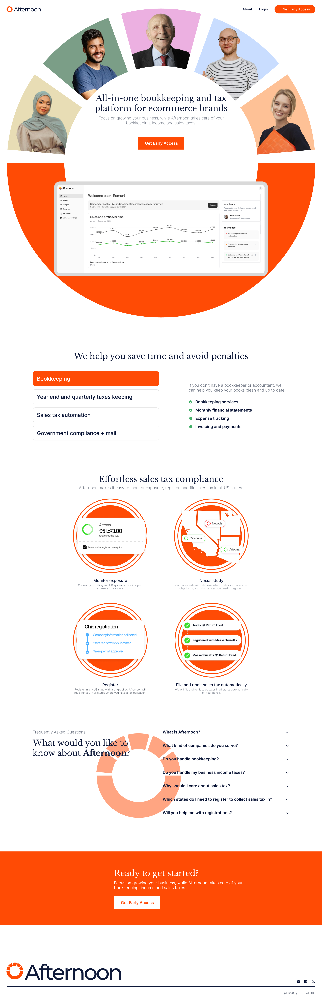

# Afternoon Landing Page

A redesign of the landing page for the AI Bookkeeping and tax platform for ecommerce & startup founders - Afternoon.co.

This project is hosted on Vercel and represents a clean, modern design with user-centric features.

Live Demo: [Afternoon Landing Page](https://afternoon-landing-page-rla5.vercel.app/)

## Features

- **Responsive Design**: Optimized for desktop, tablet, and mobile devices.
- **Next.js Framework**: Utilizes the power of the Next.js App Router for seamless performance.
- **Tailwind CSS**: Offers a modern, utility-first styling approach for rapid UI development.
- **Fast Loading**: Leveraging Next.js's server-side rendering (SSR) and static site generation (SSG) for high performance.

## Getting Started

### Prerequisites

Node.js: Make sure Node.js (v16+) is installed on your system.
Git: Ensure Git is installed for version control.

### Installation

Clone the repository:

```
git clone https://github.com/your-username/afternoon-landing-page.git
cd afternoon-landing-page
```

### Install dependencies:

```
npm install
```

### Start the development server:

```
npm run dev
```

Open http://localhost:3000 in your browser to view the page.

### Building for Production

To build the project for production:

```
npm run build
```

The optimized output will be available in the .next folder.

### Deployment

This project is already deployed on Vercel. To deploy your own version:

- Create an account on Vercel.
- Link your GitHub repository.
  Vercel will automatically build and deploy your project.

### Folder Structure

src/  
├── app/  
├── components/  
├── styles/  
├── public/

### Technologies Used

- Next.js
- React.js
- Tailwind CSS
- Vercel

### Screenshots

Here are some previews of the landing page:


_Desktop view of the landing page._

### Contributing

Contributions are welcome! If you want to improve this project, feel free to fork the repository and submit a pull request.

### License

This project is licensed under the MIT License. See the LICENSE file for details.
